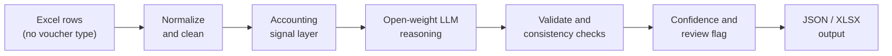
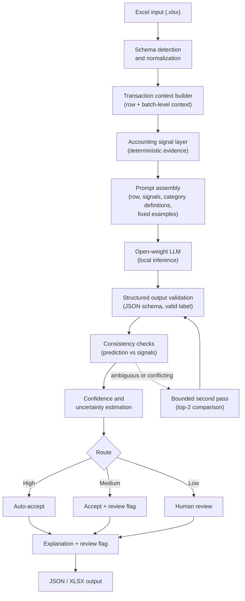
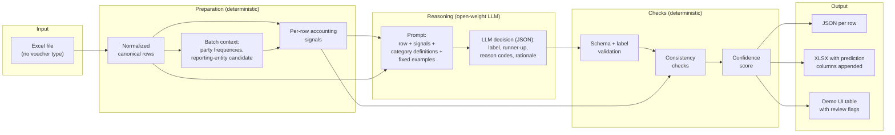
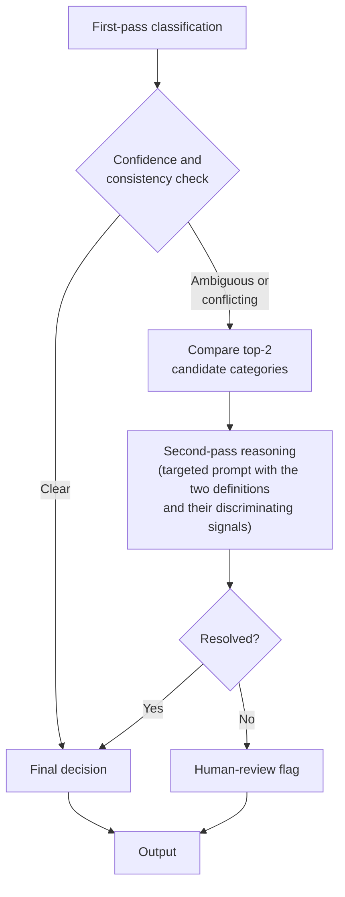
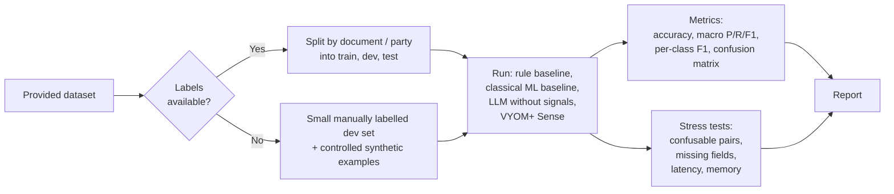

# VYOM+ Sense

**From raw transaction context to accounting intent.**

Open-weight LLM voucher classification for VYOM+ · Hacktober Fest · Track 4


-lightgrey)


</div>

---

## At a Glance

VYOM+ receives structured transaction rows (Excel) with the voucher type removed. Our job is to predict one of the **27 official voucher categories** for every row.

A voucher type is not hiding in one keyword. It comes from how fields relate: who is buying and who is selling, whether goods moved, whether money moved, whether tax applies, and whether the row reverses something earlier.

**We are not asking an LLM to guess a voucher type from a spreadsheet row. We first turn the row into accounting evidence, then ask the model to reason over that evidence.**

| Question | Short answer |
|---|---|
| What do we build? | A local classifier that reads an `.xlsx` file and outputs a voucher type, a confidence, reason codes and a review flag for each row. |
| What is different? | A deterministic **accounting signal layer** produces facts (direction, goods, money, tax, reversal, payroll, cross-border). The LLM judges over those facts. Uncertainty is part of the output. |
| Which AI? | An open-weight LLM running locally. Primary candidate: **Qwen3.5-9B**, quantized. Fallback: Qwen3.5-4B. Challenger for benchmarking: Gemma 4. All of this is a design-time choice, to be validated on the real dataset. |
| Why does AI matter? | Rules handle obvious rows. The hard cases (return vs purchase, contra vs payment, stock movement vs sale, journal vs real transaction) depend on combinations of fields, and that is where the model reasons. |
| What comes out? | JSON and XLSX with `voucher_type`, `confidence`, `reason_codes`, `rationale` and `needs_review` per row. |



> **Status:** This is a qualifier proposal. Nothing here has been implemented or benchmarked yet. Where we describe results, examples or model behaviour, they are labelled as illustrative, planned or to be validated.

---

## Table of Contents

1. [Project Name](#1-project-name)
2. [Problem Statement](#2-problem-statement)
3. [Project Overview](#3-project-overview)
4. [Proposed Solution](#4-proposed-solution)
5. [Objectives](#5-objectives)
6. [Target Users / Use Case](#6-target-users--use-case)
7. [Open-Source AI Technology Selected](#7-open-source-ai-technology-selected)
8. [Why This Technology Was Selected](#8-why-this-technology-was-selected)
9. [AI's Role in the System](#9-ais-role-in-the-system)
10. [System Architecture](#10-system-architecture)
11. [Component-Level Architecture](#11-component-level-architecture)
12. [Data / Information Flow](#12-data--information-flow)
13. [Agentic Workflow (if applicable)](#13-agentic-workflow-if-applicable)
14. [Technology Stack](#14-technology-stack)
15. [Expected Features](#15-expected-features)
16. [Implementation Approach](#16-implementation-approach)
17. [Expected Final Output](#17-expected-final-output)
18. [Future Scope / Scalability](#18-future-scope--scalability)
19. [Open-Source Dependencies / Components](#19-open-source-dependencies--components)
20. [Expected Challenges and Mitigation](#20-expected-challenges-and-mitigation)
- [Why This Project Is Different](#why-this-project-is-different)
- [Team](#team)

---

## 1. Project Name

**VYOM+ Sense** (Track 4: Intelligent Voucher Classification Using Open-Source LLMs)

---

## 2. Problem Statement

Track 4 gives us an Excel file where each row is a transaction or document with structured fields such as seller, buyer, invoice number and date, items, quantities, taxable value, GST, discounts, freight, payment details, currency, import/export details, payroll information, debit/credit information, return information, order references and delivery information. The voucher-type column is deliberately missing. This is not an OCR or extraction task. The data is already structured.

We must predict one voucher category per row from these 27 official categories:

| Group | Categories |
|---|---|
| Billing | Purchase, Sales, Purchase Return / Debit Note, Sales Return / Credit Note |
| Money | Payment, Receipt, Contra, Advance / Prepayment, Expense |
| Adjustment | Journal, Other / Miscellaneous |
| People | Salary / Payroll, Attendance |
| Orders | Purchase Order, Sales Order, Job Work In Order, Job Work Out Order |
| Goods movement | Receipt Note, Delivery Note, Rejection In, Rejection Out, Material In, Material Out, Stock Journal, Physical Stock |
| Cross-border | Import, Export |

The hard part is that many of these categories look alike on paper. A keyword like "invoice" appears in Purchase, Sales and both return types. What separates them is the relationship between fields, for example which party is our business, whether the amounts reverse an earlier document, or whether goods moved without a bill.

The system must also cope with missing, incomplete and ambiguous records, give structured output that can be scored programmatically, and be evaluated on unseen rows.

---

## 3. Project Overview

VYOM+ Sense is a local, open-weight-LLM-based classifier. Each row goes through a short pipeline:

1. Clean it and map its columns to a standard schema.
2. Derive a set of **accounting signals** from it (direction, goods, money, tax, documents, reversal, payroll, cross-border, data quality).
3. Give the row and its signals to an open-weight LLM that reasons over the full context and returns a structured decision.
4. Validate that decision, check it against the signals, and attach a confidence and a review flag.

The core idea is separation of duties:

> **Accounting signals as facts, LLM reasoning as judgment, uncertainty as a first-class output.**

The signals are not the classifier. They are evidence. A keyword like "return" appearing in a description does not decide anything by itself, but "return keyword + reversed amount + reference to an earlier invoice + our business as the original seller" is evidence the model can weigh.

---

## 4. Proposed Solution

**Step 1: Schema detection and normalization.** Real files will not have the column names we expect. We map columns to a canonical schema (seller, buyer, invoice number, date, items, quantity, taxable value, GST, and so on) using name matching and light value inspection, then clean dates, numbers, currencies and party names. The user can fix mappings in the demo UI.

**Step 2: Transaction context builder.** Each row becomes a compact, readable context: the normalized fields that are present, the fields that are missing, and the batch-level information we can compute (for example, which party appears on most rows).

**Step 3: Accounting signal layer.** Deterministic code turns the context into evidence flags. Details are in [Section 11](#11-component-level-architecture).

**Step 4: Open-weight LLM reasoning.** A locally hosted model gets the row, the signals, short definitions of the 27 categories and a few fixed examples for confusable pairs. It returns a structured JSON decision with a label, the runner-up label, reason codes and a short rationale.

**Step 5: Validation and consistency checks.** We validate the JSON schema and the label against the official list. We then run cross-checks between the prediction and the signals (for example, "Import predicted but no cross-border signal present").

**Step 6: Confidence and review routing.** Confidence is computed from measurable signals, not from the model saying "I am 90% sure". Rows route to auto-accept, accept with a review flag, or human review.

**Step 7: Output.** One JSON record per row plus an XLSX with the original columns and prediction columns appended.

### Reporting-entity / direction inference

Many pairs depend on direction: Purchase vs Sales, Purchase Return vs Sales Return, Payment vs Receipt. The same row is a Purchase for one company and a Sales entry for the other. So the system tries to infer **which party is the reporting business**.

Our approach:

- Across the whole file, normalize party names (and tax identifiers where the data has them) and count how often each party appears on the buyer side and the seller side.
- A business whose own books produced the file tends to appear in most rows, on one side or the other. If one party covers a clear majority of rows, it becomes the candidate reporting entity.
- Per row, direction is then: `we_are_buyer`, `we_are_seller`, `internal_transfer` (both parties are the same or both are our own accounts), or `unknown`.

We do not assume this always works. A file may mix several companies, party names may be inconsistent, or the file may be too small. So:

| Situation | What the system does |
|---|---|
| Clear candidate, high coverage | Use it. Direction signal is set per row. |
| Weak or competing candidates | Direction becomes `unknown`. The LLM is told so explicitly, and confidence is reduced for direction-sensitive categories. |
| User knows the answer | The UI lets them pick or type the reporting entity, which overrides the inference. |

The coverage threshold will be tuned on development data. An uncertain inference lowers confidence. It never silently forces a decision.

---

## 5. Objectives

1. Predict one valid voucher category (from the 27 official ones) for every transaction row.
2. Reason over combinations of fields rather than single keywords, especially for the confusable pairs listed in the problem statement.
3. Use an open-weight LLM running locally as the primary classification engine, with no proprietary API in the decision path.
4. Return structured, programmatically evaluable output, with reason codes and a short rationale.
5. Handle missing, noisy or ambiguous rows without silently guessing, by flagging low-confidence rows for review.
6. Provide a reproducible evaluation method: Macro-F1, per-class F1, confusion matrix, confusable-pair analysis, missing-field robustness, latency and memory.
7. Stay buildable in the final hackathon: core pipeline first, optional enhancements only if time and data allow.

---

## 6. Target Users / Use Case

| User | Need |
|---|---|
| Accountants / bookkeepers at VYOM+ customers | Skip manual voucher-type selection for thousands of rows, and focus only on the rows the system is unsure about. |
| VYOM+ product and engineering team | A classification module that sits between invoice extraction and automated voucher creation. |
| Small and mid-size businesses | Private, local processing of financial data, with no need to send ledgers to an external API. |
| Hackathon evaluators | A system they can run on a held-out Excel file and score programmatically. |

**Primary use case:** a user uploads an Excel file of transactions. The system returns a voucher type for each row, flags uncertain rows, and exports a file that can feed the next step in an accounting workflow.

---

## 7. Open-Source AI Technology Selected

**Primary candidate:** **Qwen3.5-9B** (instruction/hybrid-reasoning checkpoint), run locally in 4-bit quantized form.
**Lower-resource fallback:** **Qwen3.5-4B**.
**Benchmark challenger:** **Gemma 4** (E4B, or the 26B mixture-of-experts variant if hardware allows).

**What we mean by "open":** Qwen3.5 and Gemma 4 are *open-weight* models, meaning their weights are downloadable and runnable locally. Both families are reported to be released under the **Apache 2.0** license. Before we use any checkpoint, we will read the license file shipped with that exact artifact, because that file is authoritative. We call the models "open-weight" and, where the Apache 2.0 license is confirmed, "openly licensed". We do not claim anything beyond what the license says. The rest of the stack (Transformers, llama.cpp, pandas, scikit-learn and so on) is conventional open-source software.

> **Honesty note:** This is a **design-time selection**. We have not benchmarked these models on the Track 4 data. Final model selection will be validated during implementation using the real dataset.

---

## 8. Why This Technology Was Selected

We looked at the main open families (Qwen, Gemma, Llama, Mistral, Phi) against what this problem needs. The comparison below is qualitative and based on published model information and our own design reasoning. It is not benchmark data.

| Criterion | Why it matters here | Qwen3.5 (9B / 4B) | Gemma 4 (E4B / 26B MoE) | Llama / Mistral / Phi |
|---|---|---|---|---|
| Structured reasoning over many fields | Rows are field combinations, not prose | Hybrid thinking / non-thinking modes. Thinking can be used only for flagged rows. | Strong candidate; to be tested | Depends on exact version; to be checked |
| Instruction following and JSON output | We need a valid label every time | Designed for instruction and tool-style use | Native function-calling support reported | Varies by checkpoint |
| Local feasibility on student hardware | Judges and the final round may run on limited GPUs | Small sizes (4B, 9B) exist; quantization is widely supported | E4B is small; 26B MoE needs more memory because all experts must be loaded | Several small variants exist |
| Context length | 27 definitions + signals + examples per prompt | Long context reported | Long context reported | Varies |
| Fine-tuning feasibility | Optional LoRA/QLoRA if labelled data is provided | Wide LoRA/QLoRA tooling | Supported | Supported |
| Multilingual / narrative robustness | Item descriptions may be messy or mixed-language | Broad multilingual training reported | Multilingual reported | Varies |
| License | Must be usable and clearly stated | Apache 2.0 reported for official checkpoints; verify per artifact | Apache 2.0 reported; verify per artifact | Some use custom licenses with their own terms, so the wording "open source" needs care |

**Why Qwen3.5-9B first.** It sits at a size we can plausibly run quantized on one consumer or free-tier GPU, it has a clear license statement, and its hybrid mode lets us keep fast, non-thinking inference for most rows and use deeper reasoning only on ambiguous ones. We considered the earlier Qwen3 generation. Qwen3.5 is the newer release in the same family and reportedly improves on Qwen3 at sub-10B sizes, so it is the better default for a project starting now. We will keep the model behind a thin interface, so swapping checkpoints is a configuration change.

**Why we do not just pick the biggest model.** A 9B model is easier to run locally, faster per row and easier to explain. If the hidden dataset is large, latency and memory are scored. A model we cannot run on available hardware is not a good choice, however strong it is.

**What we will compare in the final round (planned):** Qwen3.5-9B vs Qwen3.5-4B vs one Gemma 4 variant, on the same development split, with the same prompt and signals. We will report accuracy, Macro-F1, latency and memory for each. We will pick the winner by those numbers.

**Why an open-weight approach suits this project:**

- **Privacy.** Ledgers and transaction data are sensitive. Local inference means data never leaves the machine.
- **Control.** The track requires that a proprietary API is not the primary classification engine.
- **Reproducibility.** A fixed local checkpoint and fixed prompts give repeatable evaluation.
- **Adaptability.** Open weights allow optional LoRA/QLoRA fine-tuning if labelled data is available.

---

## 9. AI's Role in the System

We split the work deliberately.

| Deterministic components do | The open-weight LLM does |
|---|---|
| Map and normalize columns | Understand relationships between fields in one row |
| Clean numbers, dates, currencies, names | Interpret ambiguous or messy item descriptions and notes |
| Extract accounting signals (flags and values) | Weigh multiple signals that disagree or only partly apply |
| Validate JSON format and label validity | Separate similar categories (return vs purchase, contra vs payment, stock journal vs sale) |
| Run consistency checks against signals | Produce the final voucher classification |
| Compute confidence from measurable evidence | Give reason codes and a short rationale |

**Could simple rules solve this?** Partly, and we will prove it by building a rule baseline. Rules are fine for obvious cases, such as a row with salary and employee fields. They break on combinations: a row with a return keyword but no reversed amount, a payment-like row where both parties are the company's own accounts, or goods moving with no tax invoice. Writing rules for all 27 categories and all their interactions turns into a large, brittle rule set. The LLM is there for the ambiguous and context-dependent cases. We still pass every row through the model, so the LLM remains the primary intelligence layer. Rules do not short-circuit it.

**Why the LLM must see signals and not raw text alone.** Models are weak at arithmetic and at tracking party names across hundreds of rows. Signals offload those parts to code, and the model does what it is good at: weighing evidence.

---

## 10. System Architecture



**Why each stage exists:**

| Stage | Reason it is in the design |
|---|---|
| Schema detection / normalization | Real files have inconsistent column names and formats. Without this nothing downstream is reliable. |
| Context builder | Direction and reporting entity need information from the whole file, not just one row. |
| Signal layer | Turns "fields" into "accounting evidence" the LLM can reason over, and offloads arithmetic and name-matching from the model. |
| Prompt assembly | Gives the model the category definitions and examples it needs, kept identical across rows for reproducibility. |
| LLM reasoning | The decision-making step. |
| Output validation | The label must be one of the 27 official categories, and the JSON must parse. |
| Consistency checks | Catches a model decision that contradicts hard evidence. |
| Confidence / routing | Lets accountants trust the easy rows and focus on the risky ones. |
| Bounded second pass | A narrow, predictable way to deal with ambiguous rows. |

---

## 11. Component-Level Architecture

### 11.1 Schema Detector and Normalizer

- Maps source columns to a canonical schema using fuzzy name matching and value patterns (for example, a column of GST-rate-like numbers or date-like strings).
- Cleans numbers (thousands separators, negatives in brackets), dates, currency codes and party names.
- Records which canonical fields are present and which are missing, since missingness is itself a signal.
- Unmapped columns are kept as "extra fields" and passed to the model as-is.

### 11.2 Transaction Context Builder

- Produces one compact context per row: present fields, missing fields, extra fields.
- Adds batch-level context: party frequency tables, and candidate reporting entity with coverage.

### 11.3 Accounting Signal Layer

The signals are **evidence, not the final classifier**. They are computed by code and handed to the model as structured facts.

| Signal family | Example signals |
|---|---|
| **Direction** | `we_are_buyer`, `we_are_seller`, `internal_transfer`, `unknown` (plus how confident the reporting-entity inference was) |
| **Goods** | items present, quantity present, inventory-related fields present, quantity sign |
| **Money** | payment mode or reference present, amount sign, taxable value, discount, freight, advance indicators |
| **Tax** | GST present or absent, GST structure (intra-state vs inter-state split where fields allow), zero-rated or exempt indicators |
| **Documents** | which document references exist: invoice, purchase order, sales order, delivery note, receipt note |
| **Reversal** | reference to an original invoice, negative or reversed amounts, return or rejection indicators |
| **Payroll** | employee identifiers, salary components, deductions, attendance fields |
| **Cross-border** | foreign currency, customs, port or shipping fields, import/export flags |
| **Data quality** | important fields missing, contradictory fields (for example, a total that does not match its components) |

### 11.4 Prompt Assembler

- Fixed system instructions, the 27 category definitions (short and accounting-focused), the row context and its signals.
- A small, fixed set of examples chosen from development data, with at least one for each hard confusable pair. If no labelled data is available, we write a few manual examples.
- The prompt prefix is identical across rows, so it can be cached for speed.

### 11.5 LLM Inference Engine

- Local, quantized inference with the selected checkpoint.
- Request: the assembled prompt. Response: a JSON object restricted to the schema in [Section 17](#17-expected-final-output).
- Batching across rows for throughput.

### 11.6 Output Validator

- Parses and validates the JSON using Pydantic. The `voucher_type` must be one of the 27 official labels.
- Invalid output triggers a limited retry. If still invalid, the row is marked `Other / Miscellaneous` with a mandatory review flag and an `invalid_model_output` reason. We will also report how often this happens.

### 11.7 Consistency Checker

Rules that compare the prediction against signals. They produce **warnings**, not forced overrides.

| Predicted | Warning when |
|---|---|
| Purchase / Sales | Direction signal contradicts the label, or no goods or services evidence at all |
| Purchase Return / Sales Return | No reversal signal |
| Salary / Payroll, Attendance | No employee or payroll signal |
| Import / Export | No cross-border signal |
| Contra | Direction is not `internal_transfer` |
| Material In / Out, Stock Journal, Physical Stock | No goods or quantity signal |
| Any | Required fields for that category are missing |

### 11.8 Confidence and Review Router

Confidence is computed from measurable signals:

- The gap between the top candidate and the runner-up (from label scores, if the inference runtime exposes them).
- Whether all consistency checks passed.
- Whether direction is known (for direction-sensitive categories).
- How complete the row is (missing important fields lower it).
- Whether the second pass agreed with the first.

We **do not** use the model's own "I'm 90% sure" as the confidence value. Self-reported confidence from LLMs tends to be poorly calibrated. Thresholds will be tuned on development data. Calibration quality (for example, reliability curves and the error rate of auto-accepted rows) is a **planned evaluation component**, and we make no promise of perfect calibration.

| Level | Action |
|---|---|
| High | Auto-accept |
| Medium | Accept, set `needs_review = true` |
| Low | Route to human review |

### 11.9 Demo Interface

A small web UI (Streamlit) for upload, column-mapping review, reporting-entity override, results table with filters (by voucher type or review flag), and download.

---

## 12. Data / Information Flow



**Walk-through for one row (illustrative):**

1. A row has a seller, a buyer, items, quantity, taxable value and GST.
2. The batch shows that the buyer appears in most rows of the file, so the reporting entity is probably the buyer and direction is `we_are_buyer`.
3. Signals: goods present, GST present, no reversal reference, no payroll fields, domestic currency.
4. The model sees these facts alongside the row and answers `Purchase`.
5. Checks pass. Confidence is high. The row is auto-accepted.

---

## 13. Agentic Workflow (if applicable)

We use a **small, bounded reasoning loop**, not an open-ended autonomous agent.

Accounting classification needs predictable, auditable behaviour. An agent that freely chooses tools or loops until it is satisfied is hard to evaluate and hard to trust with financial data. A bounded loop does what we need with fixed cost.



**Rules of the loop:**

- Triggered only for rows that fail a consistency check, have a small gap between the top two candidates, or have unknown direction on a direction-sensitive category.
- **At most one** second pass per row.
- The second pass sees a contrast prompt: the two candidate definitions plus the signals that discriminate between them (for example "does the row reverse an earlier invoice?").
- If it still disagrees with the first pass or fails checks, the row is flagged for human review. It is not forced to a label.
- Cost is bounded because only a minority of rows should be re-run. We will measure that fraction rather than assume it.

This is optional in the sense of scope: the **core pipeline works without it**, and the second pass is added once the first pass and the evaluation harness are working. We will report results with and without it, so we know if it actually helps.

---

## 14. Technology Stack

| Layer | Choice | Why |
|---|---|---|
| Language | Python | The ML and data ecosystem is all here. |
| Data handling | pandas, openpyxl | Reading and writing `.xlsx`, cleaning and feature derivation. |
| LLM (primary candidate) | Qwen3.5-9B (quantized) | See Sections 7 and 8. |
| LLM (fallback and challenger) | Qwen3.5-4B, Gemma 4 | Benchmarked on the same split. |
| Model runtime | Hugging Face Transformers for GPU work; llama.cpp (GGUF, 4-bit) as a low-VRAM or CPU fallback | Both are widely used open-source runtimes. We pick whichever gives better latency on the available hardware. |
| Structured output | Pydantic, plus runtime-level constrained or JSON decoding where the runtime supports it | Guarantees parseable output and valid labels. |
| Evaluation and baselines | scikit-learn | Metrics, confusion matrix, TF-IDF and classical baseline. |
| Interface | Streamlit | Fast to build. Fits the demo needs of upload, review and download. |
| Packaging | Local Python environment, optionally a single Docker container | Simple to run for evaluators. No cloud services needed. |

We are intentionally **not** using microservices, queues, orchestration platforms or databases. The workload is a batch over an Excel file.

---

## 15. Expected Features

### Core (must work in the final round)

1. Excel (`.xlsx`) ingestion.
2. Schema detection and normalization, with the user able to correct mappings.
3. Accounting-signal extraction, including reporting-entity inference with an `unknown` fallback.
4. Open-weight LLM classification across all 27 categories.
5. Structured JSON output with label, reason codes and rationale.
6. Output validation and basic consistency checks.
7. Confidence score and three-way routing (auto-accept, accept with flag, human review).
8. Evaluation harness with Macro-F1 and the baselines.
9. Simple demo UI and downloadable JSON/XLSX results.

### Optional (only if time, data and compute allow)

| Enhancement | Condition for adding it |
|---|---|
| Bounded second-pass ambiguity resolution | First pass and evaluation harness are stable. |
| Similar-example retrieval (embedding model + FAISS) to pick better few-shot examples | We have enough labelled rows, and it measurably helps on the development set. |
| Advanced confidence calibration (for example, fitting a small calibrator on development data) | Enough labelled data is available. |
| LoRA / QLoRA fine-tuning | Labelled training data and GPU time are available. |
| Extra model benchmarking | Time remains after the primary model works. |
| Richer dashboard | Everything above is done. |

We list these separately because we want the final-round deliverable to be a finished core system, not a half-built version of everything.

---

## 16. Implementation Approach

The final round is short. The order below is the priority order. Phases 1 to 4 plus the basic part of Phase 5 are the minimum viable system, and later phases are added as time permits.

| Phase | What we do | Output |
|---|---|---|
| **1. Dataset and schema understanding** | Inspect the provided Excel file: columns, missingness, label availability, class balance (if labels exist). | Canonical schema and column-mapping rules. |
| **2. Normalization and accounting signals** | Build cleaners, the context builder, signal extraction and reporting-entity inference. | Per-row signal table. |
| **3. Baselines** | Keyword/rule baseline and a classical ML baseline (if labels exist). Build the evaluation harness at the same time. | A scoreboard to beat, and working metrics code. |
| **4. Open-weight LLM integration** | Local inference, prompt assembly, JSON output, batching. Test Qwen3.5-9B first. | End-to-end predictions for all rows. |
| **5. Validation and uncertainty** | Pydantic validation, consistency checks, confidence score, routing. Add second pass if time allows. | Review-flagged output. |
| **6. Evaluation** | Run all systems on the held-out split. Ablations. Model comparison. Latency and memory. | Reported results (**only real, measured numbers**). |
| **7. Demo UI** | Streamlit upload, mapping review, entity override, results and download. | Demo for evaluators. |

### Evaluation Strategy



**Data handling.**

- **If labelled data is provided:** we split it into train, development and test sets. We keep the test set untouched until final reporting, and avoid leakage by splitting on documents (and on party where appropriate), not randomly on rows from the same document group. Development data is used for prompt design, example selection and threshold tuning.
- **If labels are not provided:** we build a small, manually labelled development set (labelled by us using accounting references) and add carefully controlled synthetic rows for prototyping and robustness tests. **Synthetic data will not be used to claim real-world accuracy.** It exists to find failures and test missing-field behaviour, nothing else.

**Metrics.**

| Metric | Why |
|---|---|
| Accuracy | Overall sanity check. |
| **Macro-F1** (headline) | With 27 categories, rare ones (for example Physical Stock or Job Work orders) would vanish behind overall accuracy. Macro-F1 gives each category equal weight. |
| Macro precision and recall | Separates over-predicting from under-predicting. |
| Per-class F1 | Shows exactly which categories are weak. |
| Confusion matrix | Shows which categories get confused with which. |
| Confusable-pair performance | Targeted: Purchase/Sales, the two return types, Payment/Receipt, Contra/Payment-Receipt, Journal/billing, stock movement/billing, Import/Export, Payroll/Expense. |
| Missing-field robustness | Drop or blank fields on the test set and measure the drop in Macro-F1. |
| Latency | Seconds per row and per file. |
| Memory / VRAM | Peak usage for each model candidate. |
| Confidence calibration | Accuracy by confidence bucket, and error rate among auto-accepted rows (if implemented). |

**Systems compared.**

1. Rule / keyword baseline.
2. Classical ML baseline (for example TF-IDF and engineered features with logistic regression or gradient boosting), if labelled data exists.
3. The LLM **without** the signal layer (raw row only), to measure what the signals actually add.
4. VYOM+ Sense (signals + open-weight LLM + validation).
5. VYOM+ Sense with the second pass, if built.

Embedding-based retrieval, if included, is compared against fixed few-shot examples, and kept only if it helps.

> **Actual results will be reported after implementation on the provided or held-out dataset.** This README contains no measured scores.

---

## 17. Expected Final Output

### 17.1 What the system produces

For each input row:

- `voucher_type`: one of the 27 official categories
- `confidence`: computed from the signals and checks described in Section 11.8
- `reason_codes`: short machine-readable tags for the evidence used
- `rationale`: one or two sentences in plain language
- `needs_review`: boolean flag
- `direction`: `we_are_buyer`, `we_are_seller`, `internal_transfer` or `unknown`

The minimum Track 4 output (`invoice_number` plus `voucher_type`) is always included.

### 17.2 Illustrative output (not a measured result)

> **Illustrative output, not a measured result.** The values below are examples of the format only. They did not come from a model run.

```json
{
  "invoice_number": "INV-2026-1042",
  "voucher_type": "Purchase",
  "confidence": 0.85,
  "direction": "we_are_buyer",
  "reason_codes": [
    "buyer_direction",
    "inventory_present",
    "taxable_transaction",
    "no_reversal_reference"
  ],
  "rationale": "The reporting business is the buyer, goods and quantities are present, GST is charged, and nothing indicates a return or reversal.",
  "needs_review": false
}
```

And an uncertain case, again **illustrative only**:

```json
{
  "invoice_number": "DOC-0087",
  "voucher_type": "Sales Return / Credit Note",
  "confidence": 0.52,
  "direction": "unknown",
  "reason_codes": [
    "reversal_reference_present",
    "direction_unknown",
    "runner_up_sales"
  ],
  "rationale": "The row refers to an earlier invoice and the amount is reversed, but the reporting entity could not be determined, so Purchase Return is also plausible.",
  "needs_review": true
}
```

### 17.3 Deliverables in the final round

- A working local pipeline that takes an `.xlsx` file and produces JSON and XLSX output.
- A Streamlit demo for upload, review and download.
- A reproducible evaluation script and report (metrics, confusion matrix, baseline comparison, latency and memory), generated from real runs.
- A public repository with code, setup instructions and an open-source license.

---

## 18. Future Scope / Scalability

**What the final round delivers is the core in Sections 15 to 17.** Items below are directions beyond it.

| Direction | Idea |
|---|---|
| Invoice extraction integration | Feed the output of an OCR or document-extraction step directly into the classifier, so extraction and voucher creation are connected. |
| Accountant feedback loop | Review decisions are stored, and used as new examples or fine-tuning data. |
| Per-company adaptation | Company-specific prompts, example sets or LoRA adapters that learn how a business actually books transactions. |
| Multilingual descriptions | Better handling of items and notes in regional languages. |
| Larger-scale inference | Faster serving runtimes, batching and multi-GPU deployment for large ledgers. |
| Ledger / account-head suggestion | Extend from voucher type to the accounting heads inside the voucher. |
| Anomaly and misposting detection | Flag rows where the recorded voucher type disagrees with the evidence. |
| Continuous evaluation | Monitor accuracy and review rates over time on new data. |
| Model optimization | Distillation to a smaller model, or better quantization, once the task is well defined. |

The architecture is modular: the signal layer, the model interface and the output validator are independent parts. Swapping the model, adding signals or adding categories does not require redesigning the pipeline.

---

## 19. Open-Source Dependencies / Components

| Component | Purpose |
|---|---|
| Qwen3.5-9B (primary candidate), Qwen3.5-4B (fallback) | Primary reasoning and classification. Open-weight; license to be confirmed on the exact checkpoint. |
| Gemma 4 (E4B or 26B MoE) | Benchmark challenger. Open-weight; license to be confirmed on the exact checkpoint. |
| Hugging Face Transformers | Model loading and GPU inference. |
| llama.cpp (GGUF) | Quantized low-VRAM or CPU inference fallback. |
| pandas | Data processing and signal computation. |
| openpyxl | Reading and writing Excel files. |
| Pydantic | Validating structured model output. |
| scikit-learn | Metrics, classical baseline, calibration utilities. |
| Streamlit | Demo interface. |
| *Optional:* an open embedding model | Similar-example retrieval. |
| *Optional:* FAISS | Vector search for that retrieval. |
| *Optional:* PEFT / LoRA tooling | Fine-tuning, if labelled data and compute allow. |

Everything marked optional is only used if it clearly improves the measured results.

---

## 20. Expected Challenges and Mitigation

None of the mitigations below completely removes its problem. They reduce it and make it visible.

| Challenge | Why it is hard | Mitigation |
|---|---|---|
| Missing fields | Rows may lack buyer, items, GST or references. | Missingness is a signal. Confidence drops for incomplete rows. We run missing-field stress tests. |
| Inconsistent column names | Real files rarely match our canonical schema. | Fuzzy mapping plus value-pattern checks, and a UI step to correct mappings. |
| Ambiguous transactions | Some rows genuinely fit more than one category. | Runner-up label, bounded second pass, review flag. |
| Rare voucher categories | Some of the 27 may have very few examples. | Macro-F1 as the headline metric. Per-class reporting. At least one fixed example per hard category in the prompt. |
| Purchase / Sales direction confusion | Depends on knowing who the reporting business is. | Reporting-entity inference with `unknown` fallback and manual override. Uncertainty lowers confidence. |
| Return classification | Return vs original, and purchase side vs sales side. | Reversal signals plus direction signals. Consistency checks. Targeted confusable-pair evaluation. |
| Model inconsistency or hallucination | A model may invent a label or contradict evidence. | Label validation against the official list, schema enforcement, consistency checks, limited retries, review fallback. |
| Local compute limits | A 9B model may be slow on modest hardware. | Quantization, batching, prompt-prefix reuse, and a 4B fallback. We will measure latency and VRAM rather than guess. |
| Confidence estimation | LLM self-reported confidence is unreliable. | Confidence from measurable signals. Calibration is evaluated, not assumed. |
| Hidden or unseen data | The evaluation set may have different columns or distributions. | Schema detection, no hard-coded column names, split by document and party, and robustness tests. |
| Unknown dataset labels | Labels may not be given to us. | Manual dev set, controlled synthetic data used only for debugging and robustness, never for accuracy claims. |
| Model licensing | "Open" does not always mean the same thing across models. | We read the license file of the exact checkpoint before use, and describe models as open-weight unless the license supports a stronger claim. |
| Reproducibility | LLM output can vary. | Fixed prompts, low or zero sampling temperature, pinned model and package versions, and a documented evaluation script. |

---

## Why This Project Is Different

- **Accounting-aware, not generic text classification.** The pipeline is organized around accounting concepts: direction, goods, money, tax, reversal, payroll and cross-border signals.
- **Direction is modelled explicitly.** Reporting-entity inference is designed with an `unknown` state and a manual override, because assuming it always works would be wrong.
- **The open-weight model does the actual decision-making.** Every row goes through the LLM. Rules and signals support it. They do not replace it.
- **Structured, explainable output.** Each prediction carries a label, reason codes, a rationale and a review flag.
- **Uncertainty is part of the result.** The system routes risky rows to people instead of guessing.
- **Measurable.** We plan to compare against rule and classical baselines, and against the same LLM without signals, using Macro-F1 and confusable-pair analysis.
- **Local and private by design.** Financial data stays on the machine.
- **Core first.** We separate what must work from what would be nice, so the final-round system is something we can finish.

---

## Team

**Team:** Vidarbha Hackers

| Member | Role |
|---|---|
| Khizra Bushra Raien | AI/ML & Architecture |
| Aditi Patel | Data & Evaluation |
| Neha Kewalramani | Backend & Integration |
| Nishika | UI & Documentation |

*Submitted for Elevate Hacktober Fest, Open Source AI Hackathon, Qualifier Round.*
